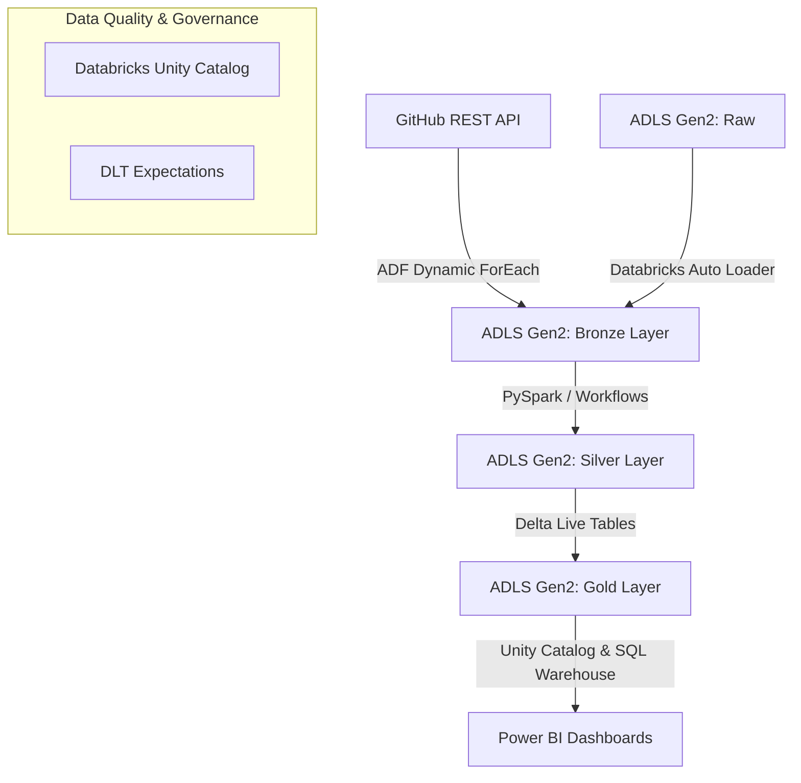

# Media-Data-Engineering-Pipeline-Medallion-Architecture-using-Azure-Databricks-and-ADF
Designed and developed a scalable Medallion Architecture (Lakehouse) for end-to-end data ingestion, integration, and transformation using Azure Data Factory (ADF) and Azure Databricks, processing raw Netflix data into business ready assets

<div align="center">

# 🎬 End-to-End Azure Data Lakehouse for Netflix Analytics
**A Production-Ready Medallion Architecture using Azure Data Factory, Databricks Auto Loader, and Delta Live Tables (DLT)**


</div>

---

## 📑 Table of Contents
1. [Project Overview](#1-project-overview)
2. [Project Materials](#2-project-materials)
3. [Project Plan (Notion-Based)](#3-project-plan-notion-based)
4. [Analyzing Requirements](#4-analyzing-requirements)
5. [Design the Data Architecture](#5-design-the-data-architecture)
6. [Choose the Right Approach](#6-choose-the-right-approach)
7. [Design the Layers of the Data Lakehouse](#7-design-the-layers-of-the-data-lakehouse)
8. [Architecture Diagram](#8-architecture-diagram)
9. [Project Initialization](#9-project-initialization)
10. [Data Pipeline Workflow & ETL Process](#10-data-pipeline-workflow--etl-process)
11. [Code Implementation (Key Snippets)](#11-code-implementation-key-snippets)
12. [Challenges & Solutions](#12-challenges--solutions)
13. [How to Run the Project](#13-how-to-run-the-project)
14. [Future Improvements](#14-future-improvements)

---

## 1. Project Overview
### Problem Statement
Traditional data pipelines often suffer from hardcoded parameters, brittle schema handling, and a lack of built-in data quality enforcement. When dealing with streaming or dynamically updating datasets (like ongoing Netflix show additions and metadata), batch-only on-premises systems become a bottleneck.

### Objective
To design and deploy a scalable, end-to-end cloud data engineering solution using the **Medallion Architecture** (Bronze, Silver, Gold). This pipeline dynamically ingests Netflix dataset files from a GitHub REST API and Azure Data Lake, transforms them using Azure Databricks, and strictly enforces data quality using Delta Live Tables (DLT) before serving insights to Power BI.

### Real-World Use Case
Media analytics teams require up-to-date, structured data to analyze viewing trends, cast information, and geographic content distribution. This Lakehouse enables real-time business intelligence by automating incremental data ingestion and guaranteeing exactly-once processing.

---

## 2. Project Materials
* **Cloud Provider:** Microsoft Azure 
* **Storage:** Azure Data Lake Storage Gen2 (ADLS Gen2)
* **Orchestration:** Azure Data Factory (ADF)
* **Computation & Transformation:** Azure Databricks 
* **Data Quality & Governance:** Delta Live Tables (DLT), Databricks Unity Catalog
* **Source Data:** Netflix Movies and TV Shows dataset (split into Master Data and Lookup Data)
* **APIs:** GitHub REST API (for lookup files: Cast, Categories, Countries, Directors)
* **Visualization:** Power BI (via Databricks Partner Connect)

---

## 3. Project Plan 
* **Epic 1: Project Initialization & Architecture**
  * Define Naming Conventions (e.g., `rg-netflix-project`, `adlsnetflix...`).
  * Create Azure Resource Group, ADLS Gen2, and ADF workspace.
  * Initialize Databricks Workspace and enable Unity Catalog.
* **Epic 2: Data Ingestion (Bronze Layer)**
  * Configure ADF HTTP Linked Services to GitHub API.
  * Build dynamic `ForEach` pipelines to iterate through array variables.
  * Configure Databricks Auto Loader for incremental master data loading.
* **Epic 3: Transformation (Silver Layer)**
  * Develop parameterized PySpark notebooks to clean and cast data.
  * Orchestrate notebooks using Databricks Workflows (If/Else tasks based on weekday parameters).
* **Epic 4: Serving (Gold Layer)**
  * Implement Delta Live Tables (DLT) declarative ETL.
  * Apply `expect_all_or_drop` data quality rules.
  * Serve optimized tables using Databricks SQL Warehouse to Power BI.

---

## 4. Analyzing Requirements
### Functional Requirements
* **Dynamic Ingestion:** Must pull multiple lookup tables seamlessly without hardcoding file paths.
* **Incremental Load:** Pipeline must automatically identify and load *only* new movie data without reprocessing old files.
* **Data Validation:** Source API availability must be checked before pipeline execution.
* **Data Cleansing:** Handle nulls, type casting (e.g., converting string durations to integers), and standardize categorizations.
* **Quality Enforcement:** Drop records dynamically if mandatory fields (e.g., `show_id`) are missing.

### Non-Functional Requirements
* **Scalability:** Must utilize distributed processing (Apache Spark) to handle volume growth.
* **Security:** Utilize Azure Managed Identities, Access Connectors, and Unity Catalog to prevent hardcoded credentials.
* **Fault Tolerance:** Guarantee exactly-once processing using checkpointing and auto-recovery.

---

## 5. Design the Data Architecture
The data flows sequentially through a tightly governed pipeline:

1. **Source:** 
   * *Lookup Data* (Cast, Category, Country, Director) resides in a GitHub repository accessed via REST API.
   * *Master Data* (Netflix Titles) drops into an ADLS Gen2 `raw` container.
2. **Processing & Orchestration (Bronze Ingestion):** 
   * ADF orchestrates the API pull using a parameterized `ForEach` loop, dumping raw CSVs into the `bronze` container.
   * Databricks Auto Loader listens to the `raw` container and streams master data incrementally to `bronze`.
3. **Storage & Transformation (Silver):** 
   * Databricks PySpark notebooks clean data, replace nulls, cast types, and store the output as Delta Tables in the `silver` container.
4. **Consumption (Gold):** 
   * Delta Live Tables (DLT) reads the Silver Delta tables, applies strict data expectations, and outputs business-ready views to the `gold` container.
   * Databricks SQL Warehouse exposes the Gold tables to Power BI.

---

## 6. Validation of the Approach
* **Lakehouse vs. Data Warehouse:** We chose a **Data Lakehouse** leveraging Delta format. It provides the flexibility and low cost of a Data Lake combined with the ACID transactions, schema enforcement, and time-travel of a Data Warehouse.
* **Auto Loader vs. Standard Structured Streaming:** Databricks Auto Loader was selected over basic Spark Streaming because it offers highly efficient directory listing, tracks previously processed files via RocksDB checkpoints, and automatically handles **Schema Evolution/Drift** via the `_rescued_data` column.
* **Delta Live Tables (DLT):** Used for the Gold layer to abstract away the boilerplate code of streaming state management. DLT simplifies dependency management and embeds data quality checks directly into the ETL definition.
* **Unity Catalog over Legacy Hive Metastore** Unity Catalog unifies governance, securely tying ADLS Gen2 external locations via Azure Access Connectors, mitigating the need for hardcoded SAS tokens or Account Keys inside notebooks.

---

## 7. Design the Layers of the Data Lakehouse
We employ the **Medallion Architecture** to strictly enforce the *Separation of Concerns*:

* **Raw / Bronze Layer:** 
  * *Purpose:* Traceability and debugging. Data lands exactly as it exists in the source.
  * *Method:* Append-only. ADF Copy Activity (Lookup tables) and Auto Loader (Master data).
* **Silver Layer:** 
  * *Purpose:* Cleansed, standardized, and filtered data. 
  * *Method:* Handled missing data (`fillna`), string splits, timestamp casting, and renamed columns. Stored natively in the optimized Delta format.
* **Gold Layer:** 
  * *Purpose:* Business-level aggregates, dimensional modeling, and strictly governed reporting datasets.
  * *Method:* Delta Live Tables applying business constraints (`show_id IS NOT NULL`). Modeled into facts (Titles) and dimensions (Cast, Directors).

---

## 8. Architecture Diagram


**Flow Explanation:**
1. ADF pulls structural data via HTTP APIs directly to the Bronze container.
2. Auto Loader captures raw Netflix streaming files into Bronze.
3. Databricks notebooks apply row-level cleanses mapping Bronze to Silver.
4. DLT pipelines enforce data expectations mapping Silver to Gold.
5. Power BI reads Gold via Partner Connect.

---

## 9. Project Initialization
### Environment Setup
1. **Resource Group:** Created `rg-netflix-project`.
2. **Storage:** Deployed ADLS Gen2 (`adlsnetflixprod`) with **Hierarchical Namespace** enabled. Created containers: `raw`, `bronze`, `silver`, `gold`.
3. **Data Factory:** Provisioned `adf-netflix-prod`.
4. **Databricks & Unity Catalog:**
   * Deployed Azure Databricks Premium workspace.
   * Created an **Azure Access Connector** mapped to the ADLS Gen2 with *Storage Blob Data Contributor* roles.
   * Enabled Unity Catalog via Databricks Account Console.
   * Created **External Locations** pointing to the Bronze, Silver, and Gold containers to govern access securely without hardcoded SAS tokens.

---

## 10. Data Pipeline Workflow & ETL Process

### 1. Azure Data Factory (Dynamic Pipeline)
Instead of 4 separate copy activities, we built one dynamic pipeline:
* **Web Activity:** Validates the presence of files/APIs before execution.
* **Variables:** A pipeline parameter array stores dictionary elements containing `folderName` and `fileName`.
* **ForEach Activity:** Iterates over the array, passing `@item().fileName` into a parameterized Dataset, ensuring elegant simplicity and high reusability.

### 2. Databricks PySpark Transformations (Silver)
* Converted string numbers into native integers (`cast(IntegerType())`).
* Filled null durations using dictionary-based `fillna({"duration_minutes": 0})`.
* Extracted master strings using the `split()` function to isolate exact ratings or titles.
* Flagged content using `when().otherwise()` (e.g., setting flag `1` for Movie, `0` for TV Show).
* Dynamically passed Source/Target folder variables between notebooks using `dbutils.widgets` and `dbutils.jobs.taskValues`.

### 3. Delta Live Tables (Gold)
* Defined streaming tables using the `@dlt.table` decorator.
* Added data quality constraints using `@dlt.expect_all_or_drop` to filter out records where critical IDs were missing.

---

## 11. Code Implementation (Key Snippets)

### Dynamic ADF Array Parameter
```json
[
  {"folderName": "Netflix_Cast", "fileName": "cast.csv"},
  {"folderName": "Netflix_Directors", "fileName": "directors.csv"}
]
```

### Auto Loader (Incremental Ingestion)
```python
# Set up checkpoint location for RocksDB state management
checkpoint_loc = "abfss://silver@adlsnetflix.dfs.core.windows.net/checkpoints/"

df = (spark.readStream
      .format("cloudFiles")
      .option("cloudFiles.format", "csv")
      .option("cloudFiles.schemaLocation", checkpoint_loc + "schema/")
      .load("abfss://raw@adlsnetflix.dfs.core.windows.net/titles/")
)

(df.writeStream
   .format("delta")
   .option("checkpointLocation", checkpoint_loc)
   .trigger(processingTime="10 seconds")
   .start("abfss://bronze@adlsnetflix.dfs.core.windows.net/netflix_titles/")
)
```

### Silver Transformation (Null Handling & Casting)
```python
from pyspark.sql.functions import col, when, split
from pyspark.sql.types import IntegerType

# Handle specific nulls
df_clean = df.fillna({"duration_minutes": 0, "duration_seasons": 1})

# Cast and derive columns
df_transformed = (df_clean
    .withColumn("duration_minutes", col("duration_minutes").cast(IntegerType()))
    .withColumn("short_title", split(col("title"), ":"))
    .withColumn("type_flag", when(col("type") == "Movie", 1).otherwise(0))
)
```

### Delta Live Tables (Declarative Data Quality)
```python
import dlt

rules = {"valid_show_id": "show_id IS NOT NULL"}

@dlt.table(name="gold_netflix_titles")
@dlt.expect_all_or_drop(rules)
def create_gold_titles():
    return spark.readStream.table("LIVE.transformed_netflix_titles")
```

---

## 12. Challenges & Solutions
1. **Challenge: Schema Drift in Source Data**
   * *Solution:* Implemented **Databricks Auto Loader** which leverages a dedicated schema location to cache inferred schemas. If a new column arrives, Auto Loader safely captures it in a `_rescued_data` column and seamlessly updates the schema without breaking the pipeline.
2. **Challenge: Hardcoded Configurations**
   * *Solution:* Avoided hardcoding by heavily utilizing `dbutils.widgets` to pass parameters securely into Databricks Workflows, and pipeline arrays in ADF.
3. **Challenge: Secure Data Access without Secret Keys**
   * *Solution:* Rather than embedding Storage Account Keys inside the PySpark script, we utilized Azure **Access Connectors** wrapped inside **Databricks Unity Catalog External Locations**, relying strictly on Azure Entra ID (Managed Identities) RBAC assignments.

---

## 13. How to Run the Project
1. Clone this repository.
2. Ensure you have an active Azure Subscription and Databricks Premium workspace.
3. Create your ADLS Gen2 account and deploy the 4 root containers (`raw`, `bronze`, `silver`, `gold`).
4. Import the ADF ARM templates provided in the `adf_pipelines/` directory.
5. Upload the Netflix `.csv` datasets to the `raw/` container or configure the GitHub REST API linked service.
6. Import the `.py` notebooks into your Databricks Workspace.
7. Configure Unity Catalog external locations pointing to your ADLS.
8. Run the ADF pipeline to load the initial lookup tables.
9. Start the Databricks Workflow to trigger the Auto Loader, Silver transformations, and DLT pipeline sequentially.
10. Connect Power BI to your Databricks SQL Warehouse to visualize the Gold tables.

---

## 14. Future Improvements
* **CI/CD Integration:** Implement Azure DevOps or GitHub Actions to automate the deployment of ADF pipelines and Databricks notebooks across Dev/QA/Prod environments.
* **Data Masking:** Enforce Dynamic Data Masking using Unity Catalog on potentially sensitive PII data before exposing it to the Gold layer.
* **Notification Framework:** Integrate Azure Logic Apps or ADF metrics to send Microsoft Teams or Email alerts upon pipeline failure.

---
<div align="center">
<i>Built with "Elegant Simplicity" prioritized over complex engineering overhead. Prioritizing maintainability and declarative data pipelines.</i>
</div>


---
*If you find this project helpful, drop a ⭐ on the repository!*
