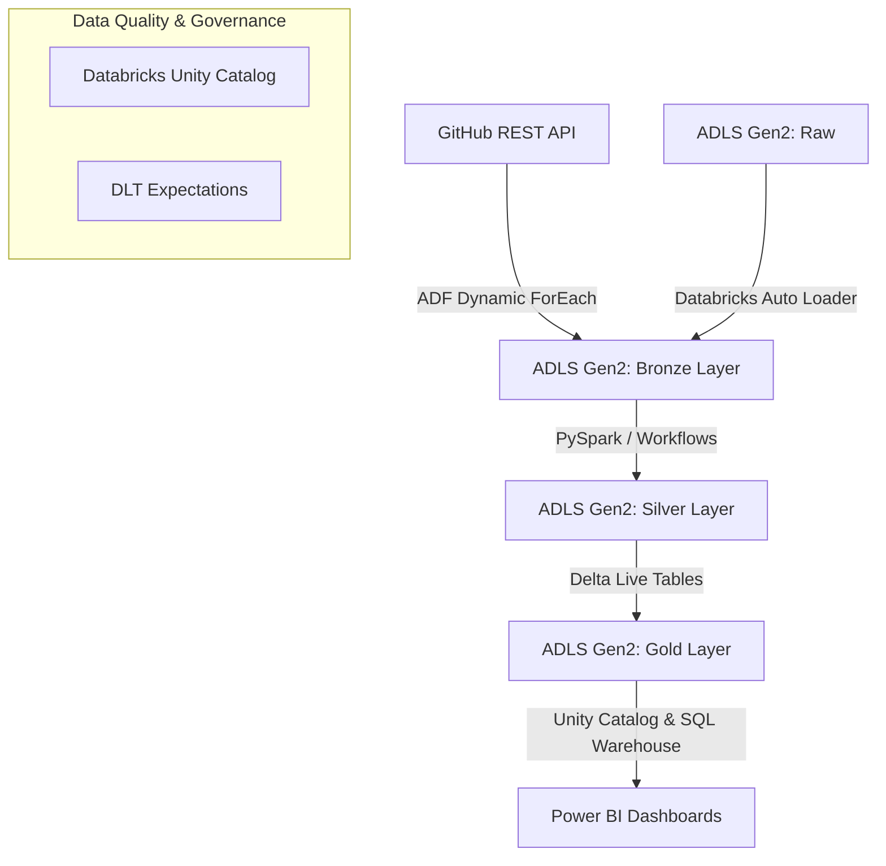

# Media-Data-Engineering-Pipeline-Medallion-Architecture-using-Azure-Databricks-and-ADF
Designed and developed a scalable Medallion Architecture (Lakehouse) for end-to-end data ingestion, integration, and transformation using Azure Data Factory (ADF) and Azure Databricks, processing raw Netflix data into business ready assets

<div align="center">


</div>

## 1. Project Overview
### Problem Statement
Traditional data pipelines often suffer from hardcoded parameters, brittle schema handling, and a lack of built-in data quality enforcement. When dealing with streaming or dynamically updating datasets (like ongoing Netflix show additions and metadata), batch-only on-premises systems become a bottleneck.

### Objective
To design and deploy a scalable, end-to-end cloud data engineering solution using the **Medallion Architecture** (Bronze, Silver, Gold). This pipeline dynamically ingests Netflix dataset files from a GitHub REST API and Azure Data Lake, transforms them using Azure Databricks, and strictly enforces data quality using Delta Live Tables (DLT) before serving insights to Power BI.

### Real-World Use Case
Media analytics teams require up-to-date, structured data to analyze viewing trends, cast information, and geographic content distribution. This Lakehouse enables real-time business intelligence by automating incremental data ingestion and guaranteeing exactly-once processing.

---

## 2. Project Materials
* **Cloud Provider:** Microsoft Azure 
* **Storage:** Azure Data Lake Storage Gen2 (ADLS Gen2)
* **Orchestration:** Azure Data Factory (ADF)
* **Computation & Transformation:** Azure Databricks 
* **Data Quality & Governance:** Delta Live Tables (DLT), Databricks Unity Catalog
* **Source Data:** Netflix Movies and TV Shows dataset (split into Master Data and Lookup Data)
* **APIs:** GitHub REST API (for lookup files: Cast, Categories, Countries, Directors)
* **Visualization:** Power BI (via Databricks Partner Connect)

---

## 3. Project Plan 
* **Epic 1: Project Initialization & Architecture**
  * Define Naming Conventions (e.g., `rg-netflix-project`, `adlsnetflix...`).
  * Create Azure Resource Group, ADLS Gen2, and ADF workspace.
  * Initialize Databricks Workspace and enable Unity Catalog.
* **Epic 2: Data Ingestion (Bronze Layer)**
  * Configure ADF HTTP Linked Services to GitHub API.
  * Build dynamic `ForEach` pipelines to iterate through array variables.
  * Configure Databricks Auto Loader for incremental master data loading.
* **Epic 3: Transformation (Silver Layer)**
  * Develop parameterized PySpark notebooks to clean and cast data.
  * Orchestrate notebooks using Databricks Workflows (If/Else tasks based on weekday parameters).
* **Epic 4: Serving (Gold Layer)**
  * Implement Delta Live Tables (DLT) declarative ETL.
  * Apply `expect_all_or_drop` data quality rules.
  * Serve optimized tables using Databricks SQL Warehouse to Power BI.

---

## 4. Analyzing Requirements
### Functional Requirements
* **Dynamic Ingestion:** Must pull multiple lookup tables seamlessly without hardcoding file paths.
* **Incremental Load:** Pipeline must automatically identify and load *only* new movie data without reprocessing old files.
* **Data Validation:** Source API availability must be checked before pipeline execution.
* **Data Cleansing:** Handle nulls, type casting (e.g., converting string durations to integers), and standardize categorizations.
* **Quality Enforcement:** Drop records dynamically if mandatory fields (e.g., `show_id`) are missing.

### Non-Functional Requirements
* **Scalability:** Must utilize distributed processing (Apache Spark) to handle volume growth.
* **Security:** Utilize Azure Managed Identities, Access Connectors, and Unity Catalog to prevent hardcoded credentials.
* **Fault Tolerance:** Guarantee exactly-once processing using checkpointing and auto-recovery.

---

## 5. Design the Data Architecture
The data flows sequentially through a tightly governed pipeline:

1. **Source:** 
   * *Lookup Data* (Cast, Category, Country, Director) resides in a GitHub repository accessed via REST API.
   * *Master Data* (Netflix Titles) drops into an ADLS Gen2 `raw` container.
2. **Processing & Orchestration (Bronze Ingestion):** 
   * ADF orchestrates the API pull using a parameterized `ForEach` loop, dumping raw CSVs into the `bronze` container.
   * Databricks Auto Loader listens to the `raw` container and streams master data incrementally to `bronze`.
3. **Storage & Transformation (Silver):** 
   * Databricks PySpark notebooks clean data, replace nulls, cast types, and store the output as Delta Tables in the `silver` container.
4. **Consumption (Gold):** 
   * Delta Live Tables (DLT) reads the Silver Delta tables, applies strict data expectations, and outputs business-ready views to the `gold` container.
   * Databricks SQL Warehouse exposes the Gold tables to Power BI.

---

## 6. Validation of the Approach
* **Lakehouse vs. Data Warehouse:** We chose a **Data Lakehouse** leveraging Delta format. It provides the flexibility and low cost of a Data Lake combined with the ACID transactions, schema enforcement, and time-travel of a Data Warehouse.
* **Auto Loader vs. Standard Structured Streaming:** Databricks Auto Loader was selected over basic Spark Streaming because it offers highly efficient directory listing, tracks previously processed files via RocksDB checkpoints, and automatically handles **Schema Evolution/Drift** via the `_rescued_data` column.
* **Delta Live Tables (DLT):** Used for the Gold layer to abstract away the boilerplate code of streaming state management. DLT simplifies dependency management and embeds data quality checks directly into the ETL definition.
* **Unity Catalog over Legacy Hive Metastore** Unity Catalog unifies governance, securely tying ADLS Gen2 external locations via Azure Access Connectors, mitigating the need for hardcoded SAS tokens or Account Keys inside notebooks.

---

## 7. Design the Layers of the Data Lakehouse
We employ the **Medallion Architecture** to strictly enforce the *Separation of Concerns*:

* **Raw / Bronze Layer:** 
  * *Purpose:* Traceability and debugging. Data lands exactly as it exists in the source.
  * *Method:* Append-only. ADF Copy Activity (Lookup tables) and Auto Loader (Master data).
* **Silver Layer:** 
  * *Purpose:* Cleansed, standardized, and filtered data. 
  * *Method:* Handled missing data (`fillna`), string splits, timestamp casting, and renamed columns. Stored natively in the optimized Delta format.
* **Gold Layer:** 
  * *Purpose:* Business-level aggregates, dimensional modeling, and strictly governed reporting datasets.
  * *Method:* Delta Live Tables applying business constraints (`show_id IS NOT NULL`). Modeled into facts (Titles) and dimensions (Cast, Directors).

---

## 8. Architecture Diagram


**Flow Explanation:**
1. ADF pulls structural data via HTTP APIs directly to the Bronze container.
2. Auto Loader captures raw Netflix streaming files into Bronze.
3. Databricks notebooks apply row-level cleanses mapping Bronze to Silver.
4. DLT pipelines enforce data expectations mapping Silver to Gold.
5. Power BI reads Gold via Partner Connect.

---

## 9. Project Initialization
### Environment Setup
1. **Resource Group:** Created `rg-netflix-project`.
2. **Storage:** Deployed ADLS Gen2 (`adlsnetflixprod`) with **Hierarchical Namespace** enabled. Created containers: `raw`, `bronze`, `silver`, `gold`.
3. **Data Factory:** Provisioned `adf-netflix-prod`.
4. **Databricks & Unity Catalog:**
   * Deployed Azure Databricks Premium workspace.
   * Created an **Azure Access Connector** mapped to the ADLS Gen2 with *Storage Blob Data Contributor* roles.
   * Enabled Unity Catalog via Databricks Account Console.
   * Created **External Locations** pointing to the Bronze, Silver, and Gold containers to govern access securely without hardcoded SAS tokens.

---

## 10. Data Pipeline Workflow & ETL Process

### 1. Azure Data Factory (Dynamic Pipeline)
Instead of 4 separate copy activities, we built one dynamic pipeline:
* **Web Activity:** Validates the presence of files/APIs before execution.
* **Variables:** A pipeline parameter array stores dictionary elements containing `folderName` and `fileName`.
* **ForEach Activity:** Iterates over the array, passing `@item().fileName` into a parameterized Dataset, ensuring elegant simplicity and high reusability.

### 2. Databricks PySpark Transformations (Silver)
* Converted string numbers into native integers (`cast(IntegerType())`).
* Filled null durations using dictionary-based `fillna({"duration_minutes": 0})`.
* Extracted master strings using the `split()` function to isolate exact ratings or titles.
* Flagged content using `when().otherwise()` (e.g., setting flag `1` for Movie, `0` for TV Show).
* Dynamically passed Source/Target folder variables between notebooks using `dbutils.widgets` and `dbutils.jobs.taskValues`.

### 3. Delta Live Tables (Gold)
* Defined streaming tables using the `@dlt.table` decorator.
* Added data quality constraints using `@dlt.expect_all_or_drop` to filter out records where critical IDs were missing.

---

## 11. Code Implementation (Key Snippets)

### Dynamic ADF Array Parameter
```json
[
  {"folderName": "Netflix_Cast", "fileName": "cast.csv"},
  {"folderName": "Netflix_Directors", "fileName": "directors.csv"}
]
```

### Auto Loader (Incremental Ingestion)
```python
# Set up checkpoint location for RocksDB state management
checkpoint_loc = "abfss://silver@adlsnetflix.dfs.core.windows.net/checkpoints/"

df = (spark.readStream
      .format("cloudFiles")
      .option("cloudFiles.format", "csv")
      .option("cloudFiles.schemaLocation", checkpoint_loc + "schema/")
      .load("abfss://raw@adlsnetflix.dfs.core.windows.net/titles/")
)

(df.writeStream
   .format("delta")
   .option("checkpointLocation", checkpoint_loc)
   .trigger(processingTime="10 seconds")
   .start("abfss://bronze@adlsnetflix.dfs.core.windows.net/netflix_titles/")
)
```

### Silver Transformation (Null Handling & Casting)
```python
from pyspark.sql.functions import col, when, split
from pyspark.sql.types import IntegerType

# Handle specific nulls
df_clean = df.fillna({"duration_minutes": 0, "duration_seasons": 1})

# Cast and derive columns
df_transformed = (df_clean
    .withColumn("duration_minutes", col("duration_minutes").cast(IntegerType()))
    .withColumn("short_title", split(col("title"), ":"))
    .withColumn("type_flag", when(col("type") == "Movie", 1).otherwise(0))
)
```

### Delta Live Tables (Declarative Data Quality)
```python
import dlt

rules = {"valid_show_id": "show_id IS NOT NULL"}

@dlt.table(name="gold_netflix_titles")
@dlt.expect_all_or_drop(rules)
def create_gold_titles():
    return spark.readStream.table("LIVE.transformed_netflix_titles")
```

---

## 12. Challenges & Solutions
1. **Challenge: Schema Drift in Source Data**
   * *Solution:* Implemented **Databricks Auto Loader** which leverages a dedicated schema location to cache inferred schemas. If a new column arrives, Auto Loader safely captures it in a `_rescued_data` column and seamlessly updates the schema without breaking the pipeline.
2. **Challenge: Hardcoded Configurations**
   * *Solution:* Avoided hardcoding by heavily utilizing `dbutils.widgets` to pass parameters securely into Databricks Workflows, and pipeline arrays in ADF.
3. **Challenge: Secure Data Access without Secret Keys**
   * *Solution:* Rather than embedding Storage Account Keys inside the PySpark script, we utilized Azure **Access Connectors** wrapped inside **Databricks Unity Catalog External Locations**, relying strictly on Azure Entra ID (Managed Identities) RBAC assignments.

---

## 13. How to Run the Project
1. Clone this repository.
2. Ensure you have an active Azure Subscription and Databricks Premium workspace.
3. Create your ADLS Gen2 account and deploy the 4 root containers (`raw`, `bronze`, `silver`, `gold`).
4. Import the ADF ARM templates provided in the `adf_pipelines/` directory.
5. Upload the Netflix `.csv` datasets to the `raw/` container or configure the GitHub REST API linked service.
6. Import the `.py` notebooks into your Databricks Workspace.
7. Configure Unity Catalog external locations pointing to your ADLS.
8. Run the ADF pipeline to load the initial lookup tables.
9. Start the Databricks Workflow to trigger the Auto Loader, Silver transformations, and DLT pipeline sequentially.
10. Connect Power BI to your Databricks SQL Warehouse to visualize the Gold tables.
---
## 14. Detailed Setup
1. Cloud Provider: Microsoft Azure (Account & Resource Group)
*	Go to Google and search "azure free account", click the first link, and click Try Azure for free.
*	Log in or click Create one to make a new Microsoft email account, fill out your personal details, and click Sign up.
*	Navigate to portal.azure.com and sign in.
*	In the Azure portal search bar, type "Resource Group", select it, and click + Create.
*	Name your Resource Group (e.g., RG-Netflix-project), select a region (e.g., Canada Central), click Review + create, and click Create again.
2. Storage: Azure Data Lake Storage Gen2 (ADLS Gen2)
*	In your Resource Group, click + Create, search the marketplace for "storage account", pick the Microsoft-provided option, and click Create.
*	Enter a globally unique storage account name (e.g., netflixprojectdatalakeunch), pick LRS for redundancy to save costs, and click Next.
*	Crucial Step: Check the box to Enable hierarchical namespace to ensure it acts as a Data Lake rather than blob storage, then click Review + create and Create.
*	Once deployed, click Go to Resource, click on Containers (under Data storage), and click + Container to create four separate containers: raw, bronze, silver, and gold.
3. Orchestration: Azure Data Factory (ADF) & GitHub API
*	Go back to your Resource Group, click + Create, search "Data Factory", select it, and click Create.
*	Name the factory (e.g., ADF_Netflix), click Review + create, click Create, and once deployed, click Launch Studio.
*	In the ADF Studio, go to the Manage tab (bottom left), click Linked Services, and click + New.
*	GitHub Connection: Search "HTTP", click Continue, name it GitHub_con, paste the base URL from the GitHub raw data link, set Authentication to Anonymous, click Test connection, and click Create.
*	ADLS Connection: Click + New again, search "Data Lake Storage Gen2", click Continue, name it DataLake_connection, pick your storage account from the dropdown, click Test connection, and click Create.
*	Go to the Author tab (pencil icon), hover over Pipelines, click the three dots, and select New Pipeline.
*	Dynamic Source Dataset: Drag a Copy Data activity to the canvas. In the Source tab, click + New, pick HTTP -> CSV, and name it DS_GitHub. Do not put the relative URL yet. Go to Advanced -> Open dataset -> Parameters, and create a parameter named file_name. Go to the Connection tab, click the relative URL box, click Add Dynamic Content, and enter @dataset().file_name.
*	Dynamic Sink Dataset: In the Sink tab, click + New, pick Azure Data Lake Gen2 -> CSV, name it DS_sink, and select your DataLake_connection. Open the dataset -> Parameters, create folder_name and file_name. In the Connection tab, pass these parameters into the folder and file path boxes.
*	ForEach Loop: Drag a ForEach activity onto the canvas. Create a pipeline variable named p_array (type: Array) and input a JSON array defining the folder and file names (e.g., [{"folder_name":"Netflix_Cast", "file_name":"cast.csv"}]). Pass this array to the ForEach activity's settings via Add Dynamic Content.
*	Cut the Copy activity and paste it inside the ForEach loop. Assign @item().file_name to the source dataset parameters, and @item().folder_name / @item().file_name to the sink dataset parameters.
*	Validation Step: Drag a Validation activity before the ForEach loop. Configure its dataset to point to your raw container and specify the master data file name to ensure the pipeline waits for the data to exist before running.
*	Click Publish All to save your work, then click Debug to run the pipeline.

4. Computation & Transformation: Azure Databricks & Unity Catalog
*	Workspace Creation: In the Azure Portal, click + Create, search "Azure Databricks", name your workspace, select the Trial pricing tier (for 14-day Premium/Unity Catalog access), and click Create.
*	Access Connector: Go to the portal search bar, search "Access Connector for Azure Databricks", name it (e.g., access_netflix), and click Create.
*	Navigate to your ADLS Gen2 storage account -> Access Control (IAM) -> Add role assignment -> select Storage Blob Data Contributor -> assign access to Managed Identity -> select your new Access Connector, and click Review + assign. Copy the Resource ID of the Access Connector.
*	Account Console & Metastore: Open Databricks, click the top-right dropdown, and select Manage Account. Click Catalog, click Create Metastore, name it, select your region, enter a dedicated ADLS container path (e.g., abfss://metastore@...), paste your Access Connector Resource ID, and click Create. Assign your workspace to this metastore.
*	Catalog & External Locations: Inside the Databricks Workspace, go to Catalog -> + Create Catalog -> name it netflix_catalog. Click External Data -> Create Credential, name it, and paste your Access Connector ID. Click Create External Location, provide the abfss:// path for your bronze container, select your credential, and click Create. Repeat this click path for the silver, gold, and raw containers.
*	Compute: Go to the Compute tab -> Create Compute -> select Personal Compute (ensure Unity Catalog is enabled) -> check "Terminate after 20 minutes" -> click Create Compute.

5. Data Quality & Governance: Delta Live Tables (DLT)
*	In Databricks, click Workspace, right-click a folder, and select Create Notebook.
*	Type Python code to define data quality expectations using decorators (e.g., defining a dictionary of rules like rules = {"rule1": "show_id IS NOT NULL"} and applying @dlt.expect_all_or_drop(rules)).
*	Define streaming tables using @dlt.table to read from the silver layer and return the data frame.
*	Pipeline Creation: Click on the Delta Live Tables tab on the left menu, then click Create Pipeline.
*	Name the pipeline (e.g., DLT_gold), select Triggered mode, browse and select your DLT notebook path, check the Unity Catalog box, and select your netflix_catalog.
*	Crucial Cluster Clicks: In the Cluster settings, set Enhanced Auto Scaling to No, set the worker size to 1 (or 0 workers / small node types) to avoid exceeding free-tier vCPU quotas, and ensure your standard all-purpose compute is terminated to free up cores. Click Create, then click Start to run the data quality checks and populate the Gold layer.

6. Visualization: Power BI (via Databricks Partner Connect)
*	In the Databricks workspace menu, click on the Marketplace tab, and locate Partner Connect.
*	Click the Power BI tile and click Connect.
*	Select your compute (either an all-purpose cluster or a Serverless SQL Warehouse if enabled).
*	Click Download connection file. This initiates a download of a .pbids file to your local computer.
*	Open the downloaded file in Power BI Desktop; the URL, host, and data connection endpoints will automatically populate, allowing you to instantly begin visualizing the Gold layer.


---
*If you find this project helpful, drop a ⭐ on the repository!*
